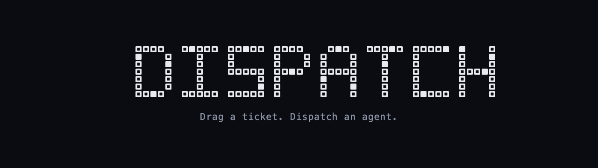
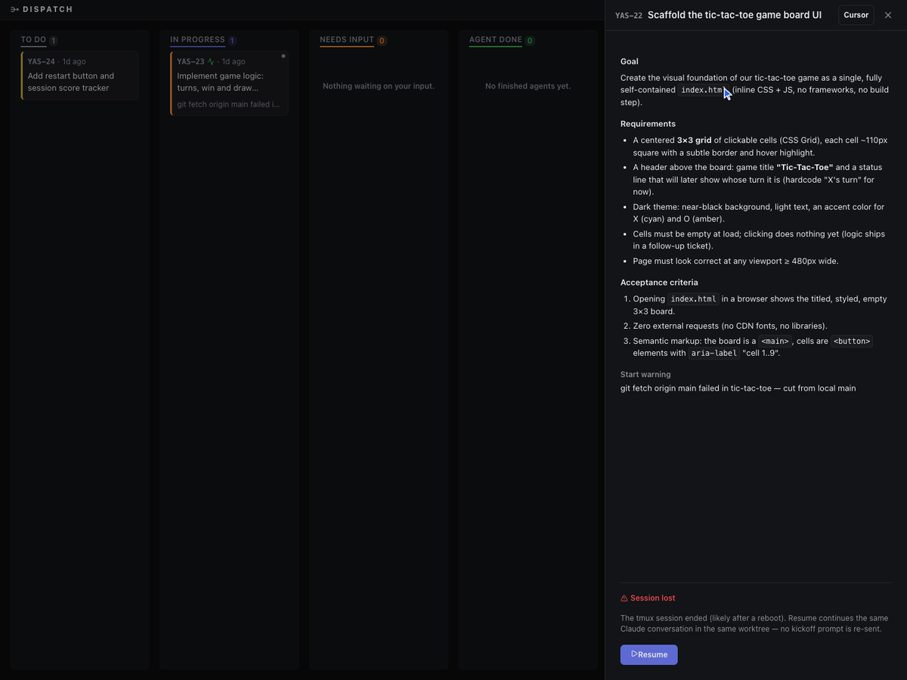

<div align="center">



**Drag a ticket. Dispatch an agent.**

A local kanban board that turns your Linear tickets into live Claude Code sessions:
each in its own git worktree, each with a real terminal in your browser.

[](LICENSE)
[](https://nodejs.org)
[](https://github.com/tsl0922/ttyd)


</div>

---

Dispatch puts a board in front of your agents. Tickets assigned to you in Linear appear in **To Do** on their own. Dragging one to **In Progress** cuts a worktree per repo, starts a plain `claude` REPL in tmux, and hands it the ticket. The board tells you which sessions actually need you, and clicking a card gives you the real terminal, not a chat transcript.

One user, one machine, localhost only. That's the design, not a limitation we're working around.

## What it does

- **Linear in, no writes back.** A poller pulls issues assigned to you in unstarted states. Descriptions render as proper markdown in the detail panel.
- **One drag = one agent.** To Do → In Progress cuts a worktree for each configured repo, starts `claude` in tmux, and sends a kickoff prompt built from the ticket (plus anything extra you type in the start modal).
- **Real terminals in the browser.** Each session gets its own [ttyd](https://github.com/tsl0922/ttyd) instance bound to loopback. What you see is the actual REPL: type into it, go fullscreen, or pop the workspace open in your editor.
- **Attention routing.** A watcher scans tmux panes every 2 seconds for status markers the agent prints. `NEEDS_INPUT` moves the card to Needs Input and shows the reason right on it; `DONE` moves it to Agent Done. Reply in the terminal and the card flips back on its own.
- **In Review keeps everything alive.** A finished ticket can sit in In Review with its session, terminal, and worktree intact. Prompt the agent with follow-ups whenever you like. Nothing is torn down until _you_ drop the card on Done.
- **Sessions survive restarts.** tmux is the source of truth, so the backend can restart (or your laptop can reboot) and the board reconciles. If a session died but the worktree survived, In Review offers **Resume**: `claude --continue` in the same worktree, same conversation, no kickoff re-sent.
- **Done means cleanup.** Dropping a card on Done confirms, kills the session and terminal, and removes the worktrees. Branches are always kept; they're the whole point.

<div align="center">



</div>

## How it works

```
Linear ──poll──▶ board store (board.json) ──SSE──▶ React board
                      │                              │
                      │                        drag to In Progress
                      ▼                              ▼
              2s pane watcher ◀──── tmux session (claude REPL)
              DISPATCH_STATUS markers    │
                                         ├── git worktree per repo
                                         └── ttyd ──▶ <iframe> terminal
```

The kickoff prompt asks the agent to print standalone status lines:

```
DISPATCH_STATUS: NEEDS_INPUT — should the status line use plain text or a flash animation?
DISPATCH_STATUS: DONE — built the board UI, committed on branch YAS-22
```

The watcher parses those from the visible pane (it survives TUI repaints, recap overlays, and prompt echoes), applies one atomic board mutation per tick, and a manual drag always wins over a marker.

The board itself is six columns:

| Column          | Meaning                                                   |
| --------------- | --------------------------------------------------------- |
| **To Do**       | Synced from Linear, ordered by priority                   |
| **In Progress** | Agent working; card shows provisioning steps and errors   |
| **Needs Input** | Agent asked something; the reason is on the card          |
| **Agent Done**  | Agent finished and said so                                |
| **In Review**   | Holding state: session/terminal/worktree stay fully alive |
| **Done**        | Deliberate human action: confirm → cleanup, branches kept |

## Getting started

You need macOS or Linux with:

- **Node ≥ 22.22**
- **tmux** and **ttyd** (`brew install tmux ttyd`)
- **git**, and the **[Claude Code](https://docs.anthropic.com/en/docs/claude-code) CLI** (`claude`) logged in
- A **Linear** account and a [personal API key](https://linear.app/settings/api)

Dispatch checks all four binaries at startup and tells you exactly what's missing.

```bash
git clone https://github.com/theyashgupta/dispatch.git
cd dispatch
npm install
npm run dev
```

The first run writes a config template to `~/.dispatch/config.json` and exits. Fill it in:

```jsonc
{
  "linearApiKey": "lin_api_...",
  "port": 4700, // backend port (loopback only)
  "pollIntervalMs": 60000, // Linear poll interval
  "repoPaths": ["/abs/path/to/repo"], // repos to cut worktrees from
  "baseBranches": ["main"], // base branch per repo (index-aligned)
  "workspaceRoot": "~/dispatch-workspaces",
}
```

Run `npm run dev` again and open `http://localhost:5173`. Tickets assigned to you show up within a minute.

Worktrees land in `workspaceRoot/<ticket>/<repo>/` on a branch named after the ticket. If a ticket touches more than one of your repos, the agent decides which ones to work in. There's no repo picker.

## Design decisions

**Why a JSON file instead of a database?** One user, low write volume, and a single-writer mutation queue with atomic writes. `board.json` is also exactly the SSE payload, which keeps the whole state path inspectable with `cat`.

**Why plain `claude` in tmux instead of an SDK?** The session you get is identical to one you'd launch by hand: same tools, same permissions, same TUI. Dispatch never sits between you and the agent; it only watches for the status lines.

**Where are the tests?** There are no unit test files, deliberately. Behavior is pinned by a golden-master replay gate (16 recorded watcher fixtures diffed byte-for-byte), an invariant checker (81 documented cross-module invariants, machine-verified), strict TypeScript, and lint rules that gate `npm run check`. The runtime pieces that matter (tmux, ttyd, real Claude sessions) are exercised against the running app.

**Why localhost only?** ttyd hands out a shell attached to a live agent session. Everything binds to `127.0.0.1` and there is no auth layer, on purpose. Don't put this on a network.

**Why one-way Linear sync?** Dispatch never writes to Linear. Your board state is yours; Linear stays authoritative for the ticket lifecycle.

More detail lives in [docs/ARCHITECTURE.md](docs/ARCHITECTURE.md), including the invariants that let the pane watcher survive Claude's TUI chrome. The engineering standards are in [docs/standards/](docs/standards/).

## Status

Dispatch is young and shaped by one person's daily use. It works well for that person. Issues and PRs are welcome, especially around Linux support, other ticket sources, and other agent CLIs.

## Roadmap

What's planned and why lives in the issue tracker. See the [`roadmap` label](https://github.com/theyashgupta/dispatch/issues?q=label%3Aroadmap).

## License

[MIT](LICENSE) © Yash Gupta
