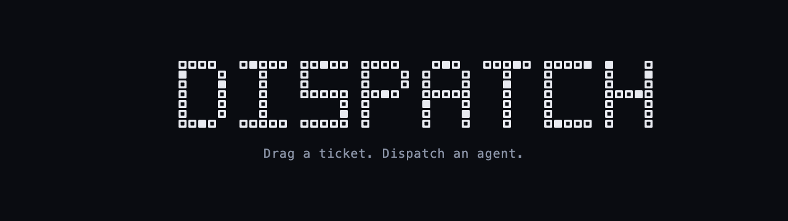
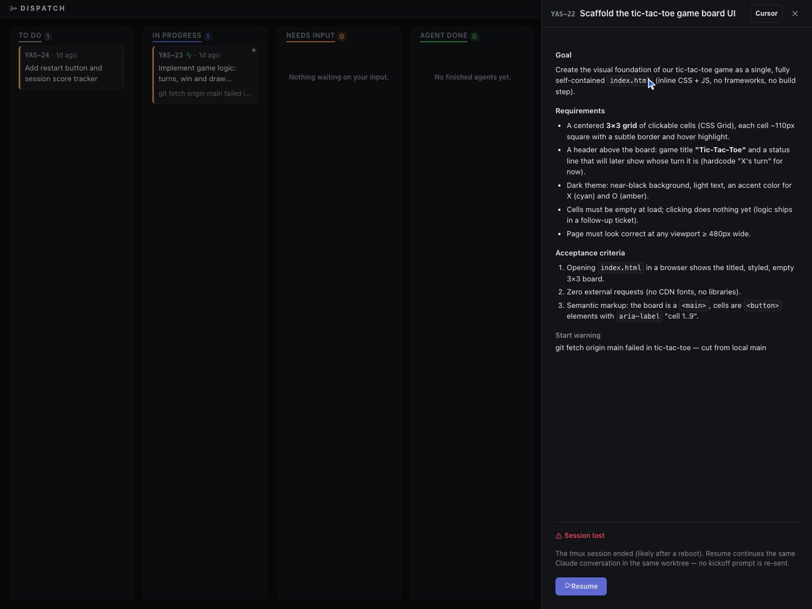

<div align="center">



**Drag a ticket. Dispatch an agent.**

A local kanban board that turns your Linear tickets into live Claude Code sessions:
each in its own git worktree, each with a real terminal in your browser — reachable from
your phone when you want it.

[](https://github.com/theyashgupta/dispatch/actions/workflows/ci.yml)
[](LICENSE)
[](https://nodejs.org)
[](https://github.com/tsl0922/ttyd)
[](CONTRIBUTING.md)


</div>

---

Dispatch puts a board in front of your agents. Tickets from Linear land in an **Inbox**; the ones you pull onto the board sit in **To Do**. Dragging one to **In Progress** picks a playbook, cuts a worktree per repo, starts a plain `claude` REPL in tmux, and hands it the ticket. The board tells you which sessions actually need you, and clicking a card gives you the real terminal, not a chat transcript.

Local-first by default. Remote access is opt-in, guarded by an access code, and gone the moment you turn it off.

## What it does

- **Linear in.** A poller pulls issues that match your filters (assigned to you by default; scope by assignee, project, team, or the current cycle, and include started work when you want it). New tickets land in the Inbox; you promote the ones worth doing into To Do. Descriptions render as proper markdown in the detail panel. Synced issues are never written back to — the only write Linear ever sees is you explicitly pushing a local ticket up.
- **Tickets without Linear.** The New ticket button creates a local card: write it yourself, or give one line of direction and a headless `claude` drafts the title and description. Local tickets ride the same board and sessions as synced ones, and one action pushes one up to Linear when it graduates (retry-safe, never a duplicate). Several tickets can also start together as a group that shares a single session.
- **Playbooks decide how the agent works.** Each session starts from a playbook that shapes the kickoff. Four ship seeded — **Write code directly**, **GSD**, **Superpowers**, and **PRD + Ralph Loop** — and you can add or edit your own in Settings. The picker remembers your last choice.
- **One drag = one agent.** To Do → In Progress cuts a worktree for each configured repo, starts `claude` in tmux, and sends a kickoff built from the ticket, the chosen playbook, and anything extra you type in the start modal.
- **Real terminals in the browser.** Each session gets its own [ttyd](https://github.com/tsl0922/ttyd) instance bound to loopback and served through Dispatch's own origin. What you see is the actual REPL: type into it, go fullscreen, or pop the workspace open in your editor.
- **Attention routing.** Status flows over a per-session Claude Code hook, with a tmux pane watcher as fallback, both feeding the same marker protocol. `NEEDS_INPUT` moves the card to Needs Input and shows the reason right on it; `DONE` moves it to Agent Done. Reply in the terminal and the card flips back on its own.
- **In Review keeps everything alive.** A finished ticket can sit in In Review with its session, terminal, and worktree intact. Prompt the agent with follow-ups whenever you like. Nothing is torn down until _you_ drop the card on Done.
- **Sessions survive restarts.** tmux is the source of truth, so the backend can restart (or your laptop can reboot) and the board reconciles. If a session died but the worktree survived, its card offers **Resume** in any column: `claude --continue` in the same worktree, same conversation, no kickoff re-sent.
- **More than one Claude login.** Add extra Claude accounts from Settings; the top bar shows the active account and how much of its session and weekly windows are used, and one click switches which account new sessions launch on. Each account keeps its own Claude config directory, so Dispatch never copies or rewrites a credential.
- **Reach it from anywhere.** Flip a switch in Settings and the whole board — live terminals included — becomes reachable over a temporary public HTTPS link, guarded by a four-word access code with a QR for your own phone. Turn it off, restart, or shut down and it's gone. [More below.](#remote-access)
- **Done means cleanup.** Dropping a card on Done confirms, kills the session and terminal, and removes the worktrees. Branches are always kept; they're the whole point.

<div align="center">



</div>

## How it works

```
Linear ──poll──▶ Inbox ──promote──▶ To Do ──drag──▶ In Progress
                                                        │
        board store ──SSE / REST──▶ React board         ├── git worktree per repo
              ▲                                          └── ttyd ──▶ proxied terminal
              │                                                        <iframe>
   hooks + 2s pane watcher ◀──────────── tmux session (claude REPL) ◀──┘
   DISPATCH_STATUS markers
```

The kickoff prompt asks the agent to print standalone status lines:

```
DISPATCH_STATUS: NEEDS_INPUT — should the status line use plain text or a flash animation?
DISPATCH_STATUS: DONE — built the board UI, committed on branch YAS-22
```

A per-session hook forwards those the instant Claude stops; the pane watcher re-scans the visible pane as a fallback and survives TUI repaints, recap overlays, and prompt echoes. Whichever channel sees a marker first wins, one atomic board mutation applies, and a manual drag always beats a marker.

The board is an Inbox plus six columns:

| Column          | Meaning                                                   |
| --------------- | --------------------------------------------------------- |
| **Inbox**       | Where synced Linear tickets land; triage into To Do       |
| **To Do**       | On the board, ready to start; newly promoted sits on top  |
| **In Progress** | Agent working; card shows provisioning steps and errors   |
| **Needs Input** | Agent asked something; the reason is on the card          |
| **Agent Done**  | Agent finished and said so                                |
| **In Review**   | Holding state: session/terminal/worktree stay fully alive |
| **Done**        | Deliberate human action: confirm → cleanup, branches kept |

## Remote access

Remote access is off by default, and while it's off Dispatch behaves exactly as it always has — loopback only, no code prompt on your own machine.

Turn it on from the **Remote** tab in Settings and Dispatch starts an on-demand [Cloudflare](https://developers.cloudflare.com/cloudflare-one/connections/connect-networks/do-more-with-tunnels/trycloudflare/) quick tunnel and mints a fresh four-word access code. You get a live public URL, a QR with the code already embedded for your phone, and the plain code to paste on a borrowed laptop. One access gate sits in front of the SPA, the API, the update stream, and the terminal WebSocket at once: local requests pass straight through, anything from the tunnel needs a valid session or gets the code-entry page. The code is checked in constant time with a progressive lockout, and a correct one sets an in-memory, HttpOnly, Secure session cookie that dies when you disable remote access or restart.

Reaching the board this way needs `cloudflared`, which Dispatch checks for only when you enable the feature (`brew install cloudflared` if it's missing). Nothing is bundled or auto-downloaded, the tunnel URL changes each time you enable, and no code or tunnel is ever resumed after a restart — the tradeoff for a zero-account setup.

## Getting started

You need macOS or Linux with:

- **Node ≥ 22.22**
- **tmux** and **ttyd** (`brew install tmux ttyd`)
- **git**, and the **[Claude Code](https://docs.anthropic.com/en/docs/claude-code) CLI** (`claude`) logged in
- A **Linear** account and a [personal API key](https://linear.app/settings/api)
- **cloudflared** only if you want remote access (`brew install cloudflared`)

Dispatch checks the required binaries at startup and tells you exactly what's missing.

```bash
npx @theyashgupta/dispatch      # or: npm i -g @theyashgupta/dispatch && dispatch
```

It picks a free port, prints the URL, and opens your browser. The first run lands on a setup screen: paste your Linear key and confirm the prereq checklist. The board starts syncing — no config file to edit, no restart.

To keep it running across reboots, install it as a background service:

```bash
dispatch service install        # launchd on macOS; status | restart | uninstall
```

`dispatch doctor` reports which binaries are present or missing. `dispatch update` guides an upgrade, and `dispatch uninstall` stops sessions and removes config/hooks (never your worktrees or playbooks). Use `dispatch --port <n>`, `--no-open`, `--help`, or `--version` as needed.

Tickets that match your filters show up within a minute. Dragging a card to In Progress opens the start modal: pick a workspace folder, tick the repos the ticket should touch (with a base branch override when you need one), choose a playbook, and add any extra direction. Worktrees land in `workspaceRoot/<ticket>/<repo>/` on a branch named after the ticket.

Running from source instead? `git clone`, `npm install`, `npm run dev` — see [CONTRIBUTING.md](CONTRIBUTING.md#dev-setup).

## Learn more

Architecture — including the invariants that let the pane watcher survive Claude's TUI chrome, the hooks status channel, and the single access gate — is in [docs/ARCHITECTURE.md](docs/ARCHITECTURE.md). The engineering standards are in [docs/standards/](docs/standards/).

## Status

Dispatch is young and shaped by one person's daily use. It works well for that person. Issues and PRs are welcome, especially around Linux support, other ticket sources, and other agent CLIs.

## Roadmap

What's planned and why lives in the issue tracker. See the [`roadmap` label](https://github.com/theyashgupta/dispatch/issues?q=label%3Aroadmap).

## Contributing

New contributors: the [good first issues](https://github.com/theyashgupta/dispatch/issues?q=is%3Aissue+is%3Aopen+label%3A%22good+first+issue%22) are the place to start. Bugs and features go through the [issue forms](https://github.com/theyashgupta/dispatch/issues/new/choose); open-ended questions and ideas live in [Discussions](https://github.com/theyashgupta/dispatch/discussions). Before sending a PR, read [CONTRIBUTING.md](CONTRIBUTING.md). It covers dev setup, the `npm run check` gate, and how behavior is verified while a proper test suite is still being built out (test contributions welcome). Security issues go through [private reporting](SECURITY.md), never a public issue. Everyone participating agrees to the [Code of Conduct](CODE_OF_CONDUCT.md).

## License

[MIT](LICENSE) © Yash Gupta
